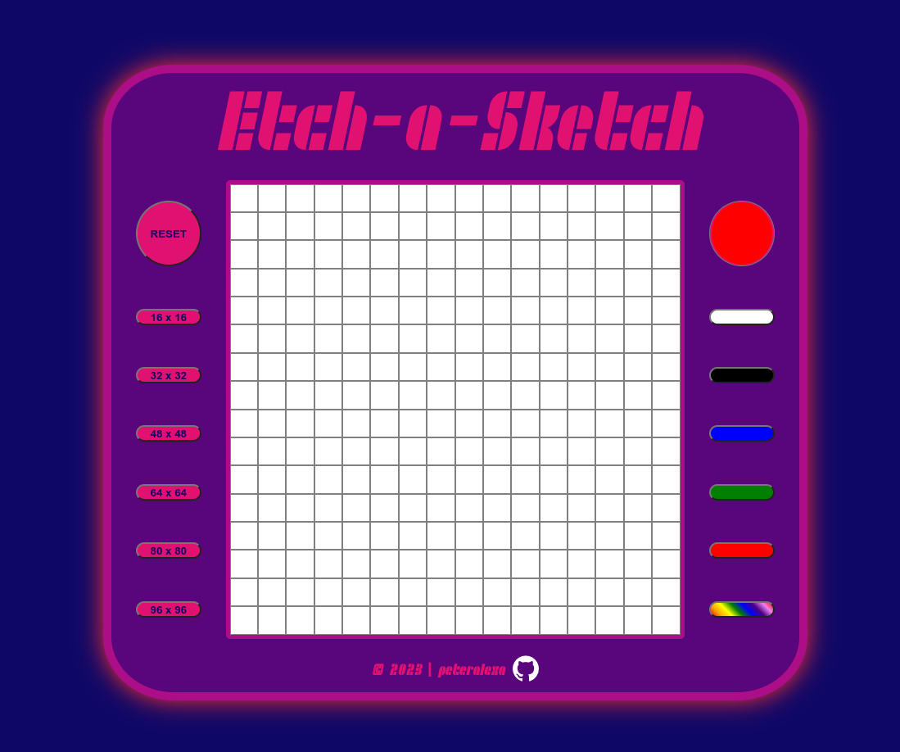

# Etch-A-Sketch

This project is my take on The Odin Project's Etch-A-Sketch assignment. It features a web-based Etch-A-Sketch created using HTML, CSS, and JavaScript, providing users with the ability to draw and create colorful patterns on a grid. Users can customize their experience by selecting different grid sizes and colors.

## Live Preview

Check out the live preview of the Etch-A-Sketch [here](https://peteralexa.github.io/top-etch-a-sketch/).

  

## Usage

1. Select a grid size from the options on the left.
2. Choose a color using the color picker or opt for a preset color.
3. Click on a grid cell to apply the selected color.
4. Hold down the left mouse button and move the mouse to draw continuously.
5. Click the "RESET" button to clear the grid and start over.

## Assets and Credits

- **Font**: The project uses the SF RetroSplice Font Family, created by ShyFoundry Fonts. You can find it [here](https://www.1001fonts.com/sf-retrosplice-font.html).

Feel free to explore the live preview and unleash your creativity with this web-based Etch-A-Sketch!
